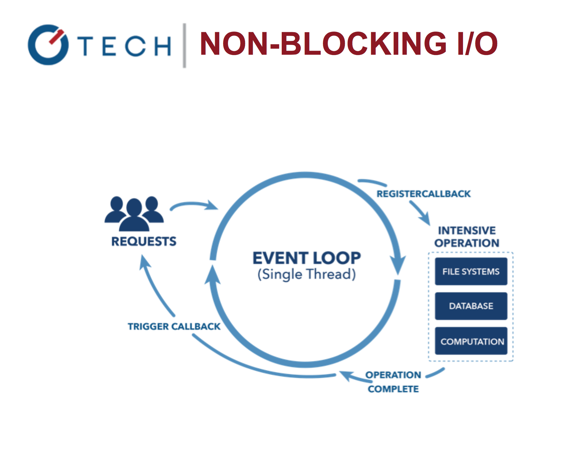

footer: © Capital One, 2015
slidenumbers: true

# You Don't Know Node.js
## Quick Guide to The Best Features

---

# Slides :page_facing_up:

<https://github.com/azat-co/you-dont-know-node>

or

PDF: <http://bit.ly/1VJWpQK>

---

# Key Takeaways

1. Event loop: Brush-up on the core concept which enables the non-blocking I/O
1. Streams and buffers: Effective way to work with data
1. Process and global: How to access more info

---

# More Key Takeaways

1. Event emitters: Crash course in the event-based pattern
1. Clusters: Fork processes like a pro
1. Handling async errors: AsyncWrap, Domain and uncaughtException
1. C++ addons: Contributing to the core and writing your own C++ addons

---

# About Presenter

Azat Mardan


Twitter: @azat_co
Email: hi@azat.co
Blog: webapplog.com

---

# About Presenter

* Technology Fellow at Capital One
* Experience: FDIC, NIH, DocuSign, HackReactor and Storify
* Books: Practical Node.js, Pro Express.js and Express.js API

---


---

# Event Loop

---



^This allows to process other tasks while IO-call not finished like this
^Nginx vs. Apach
^Blocking I/O is expensive!

---


### Basic Event Loop Example

```java
System.out.println("Step: 1");
System.out.println("Step: 2");
Thread.sleep(1000);
System.out.println("Step: 3");
System.out.println("Step: 4");
```

vs.

```js
console.log('Step: 1')
setTimeout(function () {
  console.log('Step: 3')
}, 1000)
console.log('Step: 2')
```

---

## Thinking in Async Code

```js
console.log('Step: 1')
setTimeout(function () {
  console.log('Step: 3')
  // console.log('Step 5')
}, 1000);
console.log('Step: 2')
// console.log('Step 4')
```


---


---


^This is in contrast to today's more common concurrency model where OS threads are employed. Thread-based networking is relatively inefficient and very difficult to use. Furthermore, users of Node are free from worries of dead-locking the process --- there are no locks


---


## It's still possible to write blocking code in Node.js. :flushed:

---

# Blocking Node.js Code

```js
var fs = require('fs');

var contents = fs.readFileSync('accounts.txt','utf8');
console.log(contents);
console.log('Hello Capital One\n');

var contents = fs.readFileSync('ips.txt','utf8');
console.log(contents);
console.log('Hello SECON!');
```

^data1->Hello Capital One->data2->Hello SECON!


---

# Non-Blocking Node.js Code

```js
var fs = require('fs');

var contents = fs.readFile('accounts.txt','utf8', function(err,contents){
   console.log(contents);
});
console.log('Hello Capital One\n');


var contents = fs.readFile('ips.txt','utf8', function(err,contents){
   console.log(contents);
});
console.log("Hello SECON!");
```

^Hello Capital One->Hello SECON->data1->data2

---

# Streams and Buffers

---

# Process and global

---

# Event emitters

---

# Clusters

```js
var cluster = require('cluster');
if (cluster.isMaster) {
  for (var i = 0; i < numCPUs; i++) {
    cluster.fork();
  };
} else if (cluster.isWorker) {
… // your server code
})
```

---

# Cluster Demo

1. Run `code/cluster.js` with node (`node cluster.js`).
1. Install `loadtest` with npm: `$ npm install -g loadtest`
1. Run load testing with: `$ loadtest  http://localhost:3000 -t 20 —c 10`

Press control+c on the server terminal

---

# Handling Async Errors

---

# C++ Addons

---

# Q&A


<https://github.com/azat-co/you-dont-know-node/issues>

Twitter: @azat_co
Email: hi@azat.co
