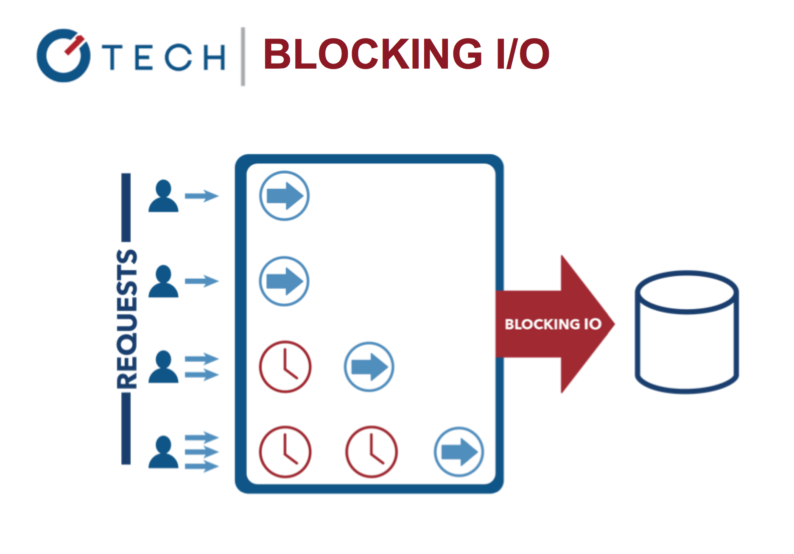

footer: © Capital One, 2016
slidenumbers: true

# You Don't Know Node
## Quick Intro to 5 Core Features

---

# This is ~~Sparta!~~ hands-on presentation 💻

---

# Slides & Code :page_facing_up:

Everything: <https://github.com/azat-co/you-dont-know-node>

or

just PDF: <http://bit.ly/1VJWpQK>

---

# Better Apps—Better Life

^Big idea: Node has some cool core features. Node is everywhere. What if the world can be a better place if more developers master Node?

---

# About Presenter

---


^Wrote and published 12 books not counting Korean, Chinese, Polish and Russian translations

---

Azat Mardan


Twitter: @azat_co
Email: hi@azat.co
Blog: webapplog.com

---

# About Presenter

* Work: Technology Fellow at Capital One (kind of a big deal)
* Experience: FDIC, NIH, DocuSign, HackReactor and Storify
* Books: React Quickly, Practical Node.js, Pro Express.js, Express.js API and 8 others
* Teach: [NodeProgram.com](http://NodeProgram.com)


---

# Capital One in Top 10 US Banks


---

# Starting with basics: Why Use Node?

---

# Input/output is one of the most expensive type tasks (>CPU) 💰

---

# Node has non-blocking I/O


---


^This allows processing other tasks while IO calls are unfinished like this
^Nginx vs. Apache
^Blocking I/O is expensive!


---

### Java Sleep

```java
System.out.println("Step: 1");
System.out.println("Step: 2");
Thread.sleep(1000);
System.out.println("Step: 3");
```


---

## Node "Sleep"

```js
console.log('Step: 1')
setTimeout(function () {
  console.log('Step: 3')
}, 1000)
console.log('Step: 2')
```

---

## Process Multiple Tasks

```js
console.log('Step: 1')
setTimeout(function () {
  console.log('Step: 3')
  // console.log('Step 5')
}, 1000);
console.log('Step: 2')
// console.log('Step 4')
```

---

# Blocking Web Server

---



---


---

# Non-Blocking Web Server

---


^This is in contrast to today's more common concurrency model where OS threads are employed. Thread-based networking is relatively inefficient and very difficult to use. Furthermore, users of Node are free from worries of dead-locking the process --- there are no locks

---


---

# [Multi-threading] is the software equivalent of a nuclear device because if it is used incorrectly, it can blow up in your face.

<http://blog.codinghorror.com/threading-concurrency-and-the-most-powerful-psychokinetic-explosive-in-the-univ>

---

# Blocking systems have to be multi-threaded

---

# Node is single threaded... and that's good! 😄


---


## It's still possible to write blocking code in Node.js. :flushed:


---

# Blocking Node.js Code

```js
// blocking.js
console.log('Step: 1')
for (var i = 1; i<1000000000; i++) {
  // This will take 100-1000ms
}
console.log('Step: 2')
```

---

# Blocking Node.js Code

```js
var fs = require('fs')

var contents = fs.readFileSync('accounts.txt','utf8')
console.log(contents)
console.log('Hello Ruby\n')

var contents = fs.readFileSync('ips.txt','utf8')
console.log(contents)
console.log('Hello Node!')
//accounts.txt->Hello Ruby->ips.txt->Hello Node!
```

---

# Non-Blocking Node.js Code

```js
var fs = require('fs')

fs.readFile('accounts.txt','utf8', function(error, contents){
   console.log(contents)
})
console.log('Hello Ruby\n')

fs.readFile('ips.txt','utf8', function(error, contents){
   console.log(contents)
})
console.log('Hello Node!')
//Hello Ruby->Hello Node->... accounts.txt->ips.txt or ips.txt->accounts.txt
```

---

# Node *typically* is much faster than other platforms

---

# How many of you reach the performance limitations of apps built with blocking I/O systems?

---

# Probably not many

---

# My Fav Node Benefit

---

# JavaScript everywhere. One language to rule 'em all!

---

* Think faster
* Reuse code
* Learn quicker

---

# Most of Node is JavaScript

* Array
* String
* Primitives
* Functions
* Objects

---


# Node !== Browser JavaScript

---

# How to create global variables (no `window` in Node), work with modules, get path to my script?

---

# `global` or `GLOBAL`

---

# It has properties!

---


# `global.__filename`
# `global.__dirname`


---


# `global.module`
# `global.require()`

---

# How do I...?

* Access CLI input?
* Get system info: OS, platform, memory usage, versions, etc.?
* Read env vars (passwords!)?

---

# `global.process` or `process`

---

# `process.pid`
# `process.versions`
# `process.arch`

---

# `process.argv`

---

# `process.env`

---


# `process.uptime()`
# `process.memoryUsage()`

---

# `process.cwd()`

---

# `process.exit()`
# `process.kill()`

---

#  Who likes and understands callbacks? 🙋

---

<http://callbackhell.com>

```js
fs.readdir(source, function (err, files) {
  if (err) {
    console.log('Error finding files: ' + err)
  } else {
    files.forEach(function (filename, fileIndex) {
      console.log(filename)
      gm(source + filename).size(function (err, values) {
        if (err) {
          console.log('Error identifying file size: ' + err)
        } else {
          console.log(filename + ' : ' + values)
          aspect = (values.width / values.height)
          widths.forEach(function (width, widthIndex) {
            height = Math.round(width / aspect)
            console.log('resizing ' + filename + 'to ' + height + 'x' + height)
            this.resize(width, height).write(dest + 'w' + width + '_' + filename, function(err) {
              if (err) console.log('Error writing file: ' + err)
            })
          }.bind(this))
        }
      })
    })
  }
})
```

---


## Callbacks are not very developmental scalable 😞

---

# Me When Working With Deeply Nested Callbacks


---

# Events

Events are part of core and supported by most of the core modules while more advanced patterns such as promises, generators, async/await are not.


---

### Events == Node Observer Pattern

* Subject
* Observers (event listeners) on a subject
* Event triggers

---

### Events

```js
var events = require('events')
var emitter = new events.EventEmitter()
```

---

### Events

In node.js an event can be described simply as a string with a corresponding callback.


```js
emitter.on('done', function(results) {
  console.log('Done: ', results)
})
```


---

### Using Event Emitters

```js
var events = require('events')
var emitter = new events.EventEmitter()

emitter.on('knock', function() {
  console.log('Who\'s there?')
})

emitter.on('knock', function() {
  console.log('Go away!')
})

emitter.emit('knock')
```

---

### Inheriting from EventEmitter

```js
// job.js
var util = require('util')
var Job = function Job() {
  // ...
  this.process = function() {
    // ...
    job.emit('done', { completedOn: new Date() })
  }
}

util.inherits(Job, require('events').EventEmitter)
module.exports = Job
```

---

### Inheriting from EventEmitter

```js
// weekly.js
var Job = require('./job.js')
var job = new Job()

job.on('done', function(details){
  console.log('Job was completed at', details.completedOn)
  job.removeAllListeners()
})

job.process()
```

---

### Listeners

```js
emitter.listeners(eventName)
emitter.on(eventName, listener)
emitter.once(eventName, listener)
emitter.removeListener(eventName, listener)
```

---

# Other Node Patterns

Node Patterns: From Callbacks to Observer: <http://webapplog.com/node-patterns-from-callbacks-to-observer/>

or

<https://github.com/azat-co/node-patterns>

---

# Problems with Large Data

* Speed: Too slow because has to load all
* Buffer limit: ~1Gb
* Overhyped (JK)

---

# Streams

## Abstractions for continuous chunking of data

---

# No need to wait for the entire resource to load

---

# Types of Streams

* Readable
* Writable
* Duplex
* Transform

---

## Streams Inherit from Event Emitter

---

# Streams are Everywhere!

* HTTP requests and responses
* Standard input/output (stdin&stdout)
* File reads and writes

---

# Readable Stream Example

`process.stdin`

Standard input streams contain data going into applications.

---

# This is achieved via a read operation.

---

# Input typically comes from the keyboard used to start the process.

---

To listen in on data from stdin, use the `data` and `end` events:

```js
// stdin.js
process.stdin.resume()
process.stdin.setEncoding('utf8')

process.stdin.on('data', function (chunk) {
  console.log('chunk: ', chunk)
})

process.stdin.on('end', function () {
  console.log('--- END ---')
})
```

---

# Demo

`$ node stdin.js`

---

# New Interface `read()`

```js
var readable = getReadableStreamSomehow()
readable.on('readable', () => {
  var chunk
  while (null !== (chunk = readable.read())) {
    console.log('got %d bytes of data', chunk.length)
  }
})
```

^readable.read is sync but the chunks are small

---

# Writable Stream Example

`process.stdout`

Standard output streams contain data going out of the applications.

---

# This is done via a write operation.

---

# Data written to standard output is visible on the command line.

---

# Writable Stream

To write to `stdout`, use the `write` function:

```js
process.stdout.write('A simple message\n')
```

---

# What about HTTP?

---

```js
const http = require('http')
var server = http.createServer( (req, res) => {
  req.setEncoding('utf8')
  req.on('data', (chunk) => {
    transform(chunk) // This functions is defined somewhere else
  })
  req.on('end', () => {  
    var data = JSON.parse(body)
    res.end()
  })
})

server.listen(1337)
```

---

# Pipe


```js
var r = fs.createReadStream('file.txt')
var z = zlib.createGzip()
var w = fs.createWriteStream('file.txt.gz')
r.pipe(z).pipe(w)
```

^Readable.pipe takes writable and returns destination

---

## What data type to use for binary data?

---

### Buffers

Binary data type, to create:

* `Buffer.alloc(size)`
* `Buffer.from(array)`
* `Buffer.from(buffer)`
* `Buffer.from(str[, encoding])`

Docs: <http://bit.ly/1IeAcZ1>

---

# Working with Buffer

```js
// buf.js
var buf = Buffer.alloc(26)
for (var i = 0 ; i < 26 ; i++) {
  buf[i] = i + 97 // 97 is ASCII a
}
console.log(buf) // <Buffer 61 62 63 64 65 66 67 68 69 6a 6b 6c 6d 6e 6f 70 71 72 73 74 75 76 77 78 79 7a>
console.log(buf.toString('utf8')) // abcdefghijklmnopqrstuvwxyz
```

---

# Buffer Convertion

```js
buf.toString('ascii') // outputs: abcdefghijklmnopqrstuvwxyz
buf.toString('ascii', 0, 5) // outputs: abcde
buf.toString('utf8', 0, 5) // outputs: abcde
buf.toString(undefined, 0, 5) // encoding defaults to 'utf8', outputs abcde
```

---

### Remember fs?

```js
fs.readFile('/etc/passwd', function (err, data) {
  if (err) return console.error(err)
  console.log(data)
});
```

`data` is buffer!

---

# Demo

```
$ node server-stream
```

---

# Streams and Buffer Demo

```js
// server-stream.js
app.get('/stream', function(req, res) {
  var stream = fs.createReadStream(largeImagePath)
  stream.pipe(res)
})
```

```
$ node server-stream
```

<http://localhost:3000/stream>
<http://localhost:3000/non-stream>

---

# Results in DevTools

`/stream` responds faster!

```
X-Response-Time
~300ms vs. 3-5s
```

---

# Stream Resources

Stream automated workshop: <https://github.com/substack/stream-adventure>

```
$ sudo npm install -g stream-adventure
$ stream-adventure
```

<https://github.com/substack/stream-handbook>


---


# How to scale a single threaded system?

---

# Cluster Usage

* Master: starts workers
* Worker: do the job, e.g., HTTP server

Number of processes = number of CPUs

---

# Clusters

```js
var cluster = require('cluster')
if (cluster.isMaster) {
  for (var i = 0; i < numCPUs; i++) {
    cluster.fork()
  }
} else if (cluster.isWorker) {
  // your server code
})
```

---

# Cluster Demo

1. Run `code/cluster.js` with node (`$ node cluster.js`).
1. Install `loadtest` with npm: `$ npm install -g loadtest`
1. Run load testing with: `$ loadtest  http://localhost:3000 -t 20 —c 10`

Press control+c on the server terminal

---

# Cluster Libraries

* Core cluster: lean and mean
* strong-cluster-control (https://github.com/strongloop/strong-cluster-control), or `$ slc run`: good choice
* pm2 (https://github.com/Unitech/pm2): good choice

---

### pm2

<https://github.com/Unitech/pm2>

<http://pm2.keymetrics.io>

Advantages:

* Load-balancer and other features
* 0s reload down-time, i.e., forever alive
* Good test coverage

---

### pm2 Demo: Typical Express Server

```js
var express = require('express')
var port = 3000
global.stats = {}
console.log('worker (%s) is now listening to http://localhost:%s',
 process.pid, port)
var app = express()
app.get('*', function(req, res) {
  if (!global.stats[process.pid]) global.stats[process.pid] = 1
  else global.stats[process.pid] += 1;
  var l ='cluser '
    + process.pid
    + ' responded \n';
  console.log(l, global.stats)
  res.status(200).send(l)
})
app.listen(port)
```

---

### pm2 Demo

Using `server.js`:

```
$ pm2 start server.js -i 0
```

In a new window:

```
$ loadtest  http://localhost:3000 -t 20 -c 10
$ pm2 list
```

---

# Spawn vs Fork vs Exec

* `require('child_process').spawn()` - large data, stream, no new V8 instance
* `require('child_process').fork()` - new V8 instance, multiple workers
* `require('child_process').exec()` - buffer, async, all the data at once

---

### Spawn Example

```js
fs = require('fs')
process = require('child_process')
var p = process.spawn('node', 'program.js')
p.stdout.on('data', function(data)) {
  console.log('stdout: ' + data)
})
```

---

### Fork Example

```js
fs = require('fs')
process = require('child_process')
var p = process.fork('program.js')
p.stdout.on('data', function(data)) {
  console.log('stdout: ' + data)
})
```

---

# Exec Example

```js
fs = require('fs')
process = require('child_process')
var p = process.exec('node program.js', function (error, stdout, stderr) {
  if (error) console.log(error.code)
})
```

---

# How to handle async errors?

---


# Handling Async Errors

Event Loop: Async errors are harder to handle/debug, because system loses context of the error. Then, application crashes.

Try/catch is not good enough.

---


### Synchronous Error in Node

```js
try {
  throw new Error('Fail!')
} catch (e) {
  console.log('Custom Error: ' + e.message)
}
```

For sync errors try/catch works fine.

---


### Async Error Example

```js
try {
  setTimeout(function () {
    throw new Error('Fail!')
  }, Math.round(Math.random()*100))
} catch (e) {
  console.log('Custom Error: ' + e.message)
}
```

The app crashes!

---

# Me When Async Error's Thrown


---

### Async Errors

 How to deal with it?

:sweat_smile:

---

## Best Practices for Async Errors?

* Listen to all “on error” events
* Listen to `uncaughtException`
* Use `domain` (soft deprecated) or [AsyncWrap](http://blog.trevnorris.com/2015/02/asyncwrap-tutorial-introduction.html)
* Log, log, log & Trace
* Notify (optional)
* Exit & Restart the process

---

### on('error')

Anything that inherits from or creates an instance of the above: Express, LoopBack, Sails, Hapi, etc.

```js
server.on('error', function (err) {
  console.error(err)
})
```  

---

### on('error') Chained Method Example

```js
var http = require(‘http’)
var server = http.createServer(app)
  .on('error', function(e) {
    console.log(‘Failed to create server’)
    console.error(e)
    process.exit(1)
  })
```

---

### on(‘error’) Named Variable Example

```js
var req = http.request(options, function(res) {
  // … processing the response
})

req.on('error', function(e) {
  console.log('problem with request: ' + e.message)
})
```

---

### uncaughtException

`uncaughtException` is a very crude mechanism for exception handling. An unhandled exception means your application - and by extension Node.js itself - is in an undefined state. Blindly resuming means anything could happen.

---

### uncaughtException

Always listen to `uncaughtException`!

```js
process.on(‘uncaughtException’, handle)
```

or

```js
process.addListener('uncaughtException', handle)
```

---


### uncaughtException Expanded Examples

```js
process.on('uncaughtException', function (err) {
  console.error('uncaughtException: ', err.message)
  console.error(err.stack)
  process.exit(1)
})
```

or

```js
process.addListener('uncaughtException', function (err) {
  console.error('uncaughtException: ', err.message)
  console.error(err.stack)
  process.exit(1)
```

---

### Domain

This module is softly deprecated in 4.0 (most likey will be separate from core module), but there's no alternatives in core as of now.

---

### Domain Example

```js
var domain = require('domain').create()
domain.on('error', function(error){
  console.log(error)
})
domain.run(function(){
  throw new Error('Failed!')
})
```

---

### Domain with Async Error Demo

domain-async.js:

```js
var d = require('domain').create()
d.on('error', function(e) {
   console.log('Custom Error: ' + e)
})
d.run(function() {
  setTimeout(function () {
    throw new Error('Failed!')
  }, Math.round(Math.random()*100))
});
```

---

# C++ Addons

---

## How to Write C/C++ binding for your IoT, hardware, drone, smartdevice, etc.?

---

### Node and C++

Create the `hello.cc` file:

```c
#include <node.h>

namespace demo {

using v8::FunctionCallbackInfo;
using v8::HandleScope;
using v8::Isolate;
using v8::Local;
using v8::Object;
using v8::String;
using v8::Value;
```

---

### Node and C++

Create the `hello.cc` file:

```c
void Method(const FunctionCallbackInfo<Value>& args) {
  Isolate* isolate = args.GetIsolate();
  args.GetReturnValue().Set(String::NewFromUtf8(isolate, "capital one"));
}

void init(Local<Object> exports) {
  NODE_SET_METHOD(exports, "hello", Method);
}

NODE_MODULE(addon, init)

}  // namespace demo
```

---

### Creating `binding.gyp`

Create `binding.gyp`:

```
{
  "targets": [
    {
      "target_name": "addon",
      "sources": [ "hello.cc" ]
    }
  ]
}
```

---

### node-gyp

```
$ npm install -g node-gyp
```

<https://github.com/nodejs/node-gyp>

^Needs Python

---

### Configuring and Building

```
$ node-gyp configure
$ node-gyp build
```

Check for compiled `.node` files in build/Release/

---

### C++ Addons Examples

<https://github.com/nodejs/node-addon-examples>

---

### Including Addon

Create `hello.js` and include your C++ addon:

```js
var addon = require('./build/Release/addon')
console.log(addon.hello()) // 'capital one'
```

Run

```
$ node hello.js
```

---

# Want to work with Node but your boss won't let you?

Capital One is hiring ~2,000 more software engineers in UK, Canada and US.

<https://jobs.capitalone.com>

We use Node and other cutting-edge open source tech a lot! (React, Kotlin, Clojure, Angular 2, TypeScript, Go, etc.)

---

# Learn More

Node at Capital One by Azat Mardan at Node Interactive 2015

<https://www.youtube.com/watch?v=BJPeLJhv1Ic>


---


# 30-Second Summary

1. Event Emitters
1. Streams
1. Buffers
1. Clusters
1. C++ Addons
1. Domain

---


# Slides & Code :page_facing_up:

Everything: <https://github.com/azat-co/you-dont-know-node>

or

just PDF: <http://bit.ly/1VJWpQK>


---


# My Contacts

Twitter: @azat_co
Email: hi@azat.co

---

# Want to learn more about Node.js?

Check out [Webapplog.com](http://webapplog.com) and [NodeProgram.com](http://NodeProgram.com) for the best online and in-person education!


---

# One Last Thing

---

# CodingHorror.com


